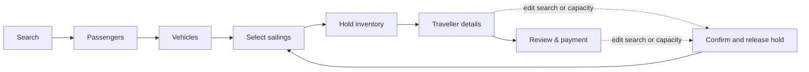

# Ferry booking flow concept demo

> **Concept demo — not an official Herjólfur booking service.** Availability, fares, account prefill, reservation timing, and payment are client-side demonstration data. No booking can be made through this site.

This dependency-free interaction prototype explores how a ferry booking can remain coherent while a traveller changes their mind. Its primary result is a shared state model and explicit transition rules, not merely a new visual layer.

The interface is deliberately calm, lightweight, responsive, and bilingual. Those qualities only help, however, if the booking cannot silently retain a sailing selected for the wrong date, party, or vehicle. The design starts with that failure mode.

## Explore the demo

Open the [live concept demo](https://fede654.github.io/ferry-booking-flow-demo/), select sailings, start the illustrative reservation hold, and then edit the dates, route, passengers, or vehicles. The confirmation and return to sailing selection make the state transition visible.

### Run locally

No build step or package installation is required. Clone the repository, serve it over HTTP, and open <http://localhost:8000>:

```bash
python3 -m http.server 8000
```

## The problem being modelled

The redesign starts from four connected design premises:

1. **Availability arrived after too much effort.** The journey required substantial passenger, vehicle, and administrative information before travellers could confidently choose a compatible sailing. A capacity-aware search must still know route, dates, passenger counts, and vehicle constraints, but names, birthdates, registration plates, contact information, and payment can wait.
2. **Backward navigation could corrupt or discard data.** Correcting an earlier decision could force travellers to enter the same information again.
3. **The final commitment was opaque.** Travellers could reach payment without a trustworthy, itemised review of the trip they were buying.
4. **State had no explicit ownership.** Route, dates, capacity, selected sailings, and identity data were treated as unrelated form fields rather than dependent classes of booking state.

This ordering can create **booking-form stress**. Each high-effort field becomes a sunk cost before the traveller knows whether a suitable sailing exists, increasing the perceived cost of an unavailable result or backward navigation.

These are not cosmetic defects. They are a state-management problem: some values remain valid after an upstream edit, while others do not.

## Change the domain before styling the interface

Instead of treating the flow as a sequence of pages, the demo models a booking as a constrained state system:

| State class | Variables | Rule |
| --- | --- | --- |
| Search, `X_S` | trip type, route, dates | Changes invalidate held inventory and re-query availability |
| Capacity, `X_C` | passenger counts per leg, vehicles | Changes invalidate held inventory and re-query availability |
| Inventory, `X_I` | selected sailings and reservation hold | Release when search or capacity changes |
| Identity, `X_D` | names, birthdates, contact details, plates | Preserve across backward navigation |

The central invariant is:

> **Remember what is still true. Discard—loudly—what silently is not.**

A passenger name remains true after the departure date changes. A sailing held for the previous date does not. Treating both pieces of data as equally persistent can leave a booking in a dangerously misleading state.

## The state-machine rule

A held sailing is valid only for the exact search and capacity state that produced it:

```text
mutate(search ∪ capacity)
  → confirm release when inventory is held
  → release selected sailings and timer
  → preserve identity data
  → re-query availability
  → return to sailing selection
```

This is a deliberately pessimistic form of constraint propagation. A changed vehicle or passenger count might still fit the selected sailing, but the traveller must choose that sailing again under the new terms. The alternative could leave them believing they hold an option they never selected for the current booking.



The dotted paths are guarded regressions. They release inventory, never identity data.

## Where the ferry operator’s systems enter

**Select sailings** is the boundary between this interaction model and the operator’s authoritative systems. In production, the client cannot decide availability or create a reservation by itself.

1. After route, dates, passenger counts, and vehicle constraints are known, the client requests eligible sailings from the ferry company’s availability and capacity services.
2. When the traveller confirms specific sailings, the backend creates the timed hold and returns an authoritative hold identifier and expiry.
3. The client displays that expiry and continues collecting traveller details, while the backend remains the source of truth for capacity, concurrent bookings, hold expiry, and payment confirmation.
4. On an upstream edit, the client asks the backend to release the hold, clears its local inventory state, and queries availability again.

This demo simulates those responses locally so the state transitions can be inspected. Its timer is illustrative, not a reservation. A production implementation must make availability queries, holds, releases, and final booking transactions server-side and auditable.

## What the demo demonstrates

The implementation translates the model into one shared client-side state and explicit transition rules:

- Passenger counts may differ by leg, while the identity roster is reconciled without losing entered details.
- Multiple vehicles are evaluated conservatively: every vehicle must fit a sailing.
- The illustrative reservation timer begins only when the traveller confirms sailings, not when a default option is displayed.
- Route, date, trip-type, passenger, and vehicle changes follow the same release-and-reselect rule after a hold begins.
- The compact-layout **Edit search** control closes before returning the traveller to sailings, keeping visible navigation and state aligned.
- The checkout review restates itinerary, passengers, vehicles, sailings, and per-leg pricing before payment.

The responsive layout follows the same model. At compact widths, the search becomes an editable context bar, progress becomes a compact strip, and the current total and primary action remain available in a commit bar. These presentation choices keep the current booking state legible while the traveller moves through the flow.

## Verification

During development, unit tests and browser-driven desktop, phone, and tablet journeys exercised inventory release, retained traveller details, timer lifecycle, required fields, review totals, bilingual initialisation, and the compact-layout edit-search regression. Those development tests are not included in this static public distribution.

The central behavioural check is that an upstream edit must produce either the same valid booking state or an explicit regression to a new sailing choice. The interface must never present stale inventory as current.

## Source map

- [`index.html`](./index.html) — interface markup and the concept-demo notice
- [`improved-script.js`](./improved-script.js) — shared booking state and transition rules
- [`improved-styles.css`](./improved-styles.css) — desktop and responsive presentation
- [`fare-catalog.js`](./fare-catalog.js) — demonstration fare data and calculations
- [`mock-availability.js`](./mock-availability.js) — simulated schedules, service states, and capacity

## Scope

This is a frontend research and interaction prototype, not a production booking system. It has no server-side availability, payment processing, authentication, persistence, or reservation capability. Its purpose is to make the state logic inspectable and show what a coherent implementation of that model feels like.
