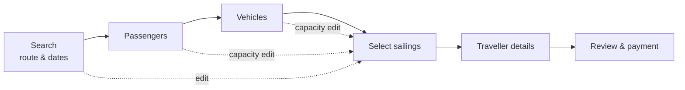

# Ferry booking flow demo

> **Concept demo — not an official Herjólfur booking service.** Availability, fares, account prefill, reservation timing, and payment are client-side demonstration data. No booking can be made through this site.

This project is a formal redesign of a ferry-booking journey. Its primary result is not the visual layer: it is a state model that keeps a booking coherent while a traveller changes their mind.

The interface is deliberately calm, responsive, bilingual, and fast. None of that is useful, though, if the booking can silently retain a sailing selected for the wrong date, party, or vehicle. The design work starts with that failure mode.

## The original problem

The baseline journey exposed four connected problems:

1. **Search and availability were out of order.** Travellers selected dates before the system knew how many passengers or what vehicle capacity they required.
2. **Backward navigation could corrupt or discard data.** Correcting an earlier decision could force people to re-enter information.
3. **The final commitment was opaque.** People could reach payment without a trustworthy, itemised review of their actual trip.
4. **State had no explicit ownership.** Route, dates, capacity, selected sailings, and identity data were treated as form fields rather than dependencies.

These are not cosmetic defects. They are a logic problem: some values stay valid after an upstream edit, while others do not.

## Change the domain before styling the interface

Instead of treating the flow as a sequence of pages, this demo models a booking as a constrained state system:

| State class | Variables | What happens when an upstream choice changes? |
| --- | --- | --- |
| Search, `Xₛ` | trip type, route, dates | Re-query sailings |
| Capacity, `X𝚌` | passenger counts per leg, vehicles | Re-check physical fit |
| Inventory, `Xᵢ` | selected sailings and reservation hold | Release and reselect |
| Identity, `X𝚍` | names, birthdates, contact details, plates | Preserve |

The central invariant is:

> **Remember what is still true. Discard—loudly—what silently is not.**

A passenger name remains true after the departure date changes. A sailing held for the previous date does not. Treating both pieces of data as equally persistent is the source of a dangerous booking error.

## The state-machine rule

The flow treats a held sailing as valid only for the exact search and capacity state that produced it:

```text
mutate(search ∪ capacity)
  → confirm release when inventory is held
  → release selected sailings and timer
  → preserve identity data
  → re-query availability
  → return to sailing selection
```

This is a deliberately pessimistic form of constraint propagation. A newly changed vehicle or passenger count might still fit a selected sailing, but the traveller must choose that sailing again under the new terms. The alternative would leave them believing they hold an option they never selected for the current booking.



The dotted paths are guarded regressions. They release inventory, never identity data.

## What the demo proves

The implementation translates that model into one shared client-side state and explicit transition rules:

- Passenger counts may differ by leg; the identity roster is reconciled without losing entered details.
- Multiple vehicles are evaluated conservatively: every vehicle must fit a sailing.
- A reservation timer begins only when the traveller confirms sailings, not merely when a default option is displayed.
- Route, date, trip-type, passenger, and vehicle changes follow the same release-and-reselect rule.
- The mobile “Edit search” control closes before returning the traveller to sailings, keeping the navigation state coherent with the visible state.
- The checkout review restates itinerary, passengers, vehicles, sailings, and per-leg pricing before payment.

The responsive layout follows the same model. On mobile, the search becomes an editable context bar, progress becomes a compact strip, and the current total/action stay available in a commit bar. Those are not merely presentation choices: they keep the current booking state legible while the traveller moves through it.

## Verification

The source project exercises the flow with unit tests and browser-driven desktop, phone, and tablet journeys. They cover inventory release, retained traveller details, timer lifecycle, required fields, the review total, bilingual initialisation, and the mobile edit-search regression.

The most important check is behavioural: after any upstream edit, the UI must show either the same valid booking or an explicit regression to a new sailing choice. It must never present stale inventory as current.

## Explore the demo

Open the [live concept demo](https://fede654.github.io/ferry-booking-flow-demo/), begin a search, select sailings, then edit dates, routes, passengers, or vehicles after starting the reservation hold. The resulting confirmation and return to sailing selection are the model doing its work.

## Scope

This is a frontend research and interaction prototype, not a production booking system. It has no server-side availability, payment processing, authentication, persistence, or actual reservation capability. The goal is to make the state logic inspectable—and to show what a coherent implementation of it feels like.
